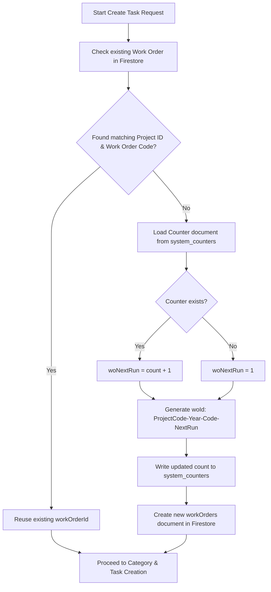

# Work Order Document Numbering Generation Summary

This document summarizes the numbering generation logic and database structure for the `workOrders` collection in the Labor Management System.

---

## 1. Collection Structure & Fields
* **Firestore Collection Name**: `workOrders` (in the code referred to as `WORK_ORDERS_COLLECTION = 'workOrders'`)
* **Document ID**: The document ID is generated dynamically and acts as the unique `workOrderId`.
* **Fields inside the document**:
  ```typescript
  {
    workOrderId: string;      // The generated document ID (e.g. "WH-2026-GEN-0001")
    projectId: string;        // The Firestore ID of the project
    workOrderCode: string;    // The code of the work order (defaults to "GEN")
    workOrderName: string;    // The name of the work order (defaults to "General")
    updatedAt: Date;          // Timestamp of the last update
  }
  ```

---

## 2. Document ID Formatting
The document ID (`woId`) is generated using the following standard template:

$$\text{\{ProjectCode\}}-\text{\{CurrentYear\}}-\text{\{WorkOrderCode\}}-\text{\{ZeroPaddedSequence\}}$$

### Segment Breakdown:
1. **`{ProjectCode}`**: The short code of the project (e.g., `WH` for Warehouse project).
2. **`{CurrentYear}`**: The 4-digit current calendar year at the time of creation (e.g., `2026`).
3. **`{WorkOrderCode}`**: The code provided in the input, defaulting to `GEN` (e.g., `WOA`, `WOP`, `GEN`).
4. **`{ZeroPaddedSequence}`**: A 4-digit sequential running number, padded with leading zeros (e.g., `0001`, `0002`).

**Examples of generated IDs**:
* `WH-2026-GEN-0001`
* `WH-2026-WOA-0005`
* `WH-2026-WOP-0012`

---

## 3. Sequential Counter Registry
To generate the running numbers safely in a concurrent environment, the system utilizes a dedicated collection called `system_counters`.

* **Counter Collection Name**: `system_counters`
* **Counter Document ID format**: 
  ```
  wo_counter_${ProjectCode}_${WorkOrderCode}_${CurrentYear}
  ```
  *Example*: `wo_counter_WH_GEN_2026`
* **Fields inside the counter document**:
  ```typescript
  {
    count: number;     // The last assigned sequence number (e.g., 5)
    updatedAt: Date;   // Timestamp of the counter update
  }
  ```

---

## 4. Numbering Generation Workflow
The generation of the work order document number takes place inside a **Firestore Transaction** to prevent race conditions when multiple users create tasks concurrently.



### Step-by-Step Logic:
1. **Search Duplicates**: First, the system queries the `workOrders` collection where `projectId == input.projectId` and `workOrderCode == input.workOrderCode` (or `'GEN'`).
2. **Reuse Existing ID**: If a document matches, the system **reuses its ID** to avoid creating duplicate work order records.
3. **Fetch Running Counter**: If no matching work order is found:
   * The transaction reads the specific counter document: `system_counters/wo_counter_${ProjectCode}_${WorkOrderCode}_${CurrentYear}`.
   * If it exists, the system increments the count: `woNextRun = count + 1`.
   * If it does not exist, the sequence starts at `woNextRun = 1`.
4. **Construct ID & Save**:
   * The new `woId` string is built using the format.
   * The counter document is updated/created inside the transaction with the new `count` value.
   * The new `workOrders` document is written to Firestore using `woId` as its path/key.
