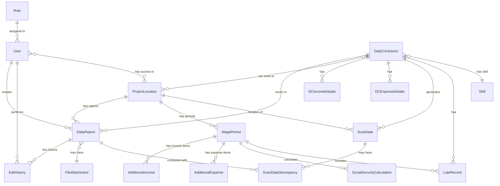

# Data Model: ระบบจัดการแรงงานและรายงานประจำวัน

**Feature**: 001-labor-daily-report
**Created**: 2025-10-23
**Version**: 1.0

## Overview

This document defines the comprehensive data model for the Labor Management System, including all entities, their relationships, validation rules, and Firestore schema definitions. The system manages daily labor reports, overtime tracking, wage calculations, and fingerprint scan data monitoring.

---

## Entity Relationship Diagram



---

## Entity Definitions

### 1. User (ผู้ใช้งาน)

**Description**: System users with authenticated access and role-based permissions. Users can manage daily reports, projects, and DC information based on their assigned role.

**Firestore Collection**: `users`

#### Fields

| Field | Type | Required | Description | Validation Rules |
|-------|------|----------|-------------|------------------|
| id | string | Yes | Auto-generated document ID | Firestore auto-generated |
| employeeId | string | Yes | Employee identification number | Unique, non-empty |
| username | string | Yes | Login username | Unique, non-empty, no spaces |
| passwordHash | string | Yes | Hashed password (bcrypt) | Hashed using bcrypt |
| name | string | Yes | Full name in Thai | Non-empty |
| roleId | string | Yes | Reference to Role document | Must exist in roles collection |
| department | string | Yes | Department code | One of: PD01, PD02, PD03, PD04, PD05 |
| dateOfBirth | Timestamp | No | Birth date | Must be in the past |
| startDate | Timestamp | Yes | Employment start date | Must be in the past or today |
| projectLocationIds | string[] | Yes | Array of accessible project IDs | Each ID must exist in projectLocations |
| isActive | boolean | Yes | Active status | Default: true |
| createdAt | Timestamp | Yes | Creation timestamp | Auto-generated |
| updatedAt | Timestamp | Yes | Last update timestamp | Auto-updated |
| createdBy | string | Yes | User ID who created this record | Reference to users collection |
| updatedBy | string | Yes | User ID who last updated | Reference to users collection |

#### Relationships

- **Has Role**: Many-to-One with `Role`
- **Has Access To**: Many-to-Many with `ProjectLocation`
- **Creates**: One-to-Many with `DailyReport`
- **Performs**: One-to-Many with `EditHistory`

#### Indexes

```typescript
// Composite indexes
users_username_isActive: [username ASC, isActive ASC]
users_employeeId_isActive: [employeeId ASC, isActive ASC]
users_roleId_department: [roleId ASC, department ASC]
users_department_isActive: [department ASC, isActive ASC]
```

#### TypeScript Interface

```typescript
interface User {
  id: string;
  employeeId: string;
  username: string;
  passwordHash: string;
  name: string;
  roleId: string;
  department: 'PD01' | 'PD02' | 'PD03' | 'PD04' | 'PD05';
  dateOfBirth?: Date;
  startDate: Date;
  projectLocationIds: string[];
  isActive: boolean;
  createdAt: Date;
  updatedAt: Date;
  createdBy: string;
  updatedBy: string;
}
```

#### Validation Rules (FR-M)

- **FR-M-001**: Admin must be able to add/edit/delete user data
- **FR-M-002**: All required fields must be present
- **FR-M-003**: Role must be one of 8 valid roles (AM, FM, SE, OE, PE, PM, PD, MD)
- **FR-M-004**: Admin can assign project access permissions
- **FR-M-005**: Username must be unique across all users
- **FR-M-006**: Password must be hashed using bcrypt before storage

---

### 2. Role (บทบาท)

**Description**: User roles defining permissions and access levels within the system.

**Firestore Collection**: `roles`

#### Fields

| Field | Type | Required | Description | Validation Rules |
|-------|------|----------|-------------|------------------|
| id | string | Yes | Auto-generated document ID | Firestore auto-generated |
| code | string | Yes | Role code | Unique, one of: AM, FM, SE, OE, PE, PM, PD, MD |
| name | string | Yes | Role name in Thai | Non-empty |
| nameEnglish | string | Yes | Role name in English | Non-empty |
| description | string | No | Role description | - |
| permissions | object | Yes | Permission flags | See permissions structure below |
| level | number | Yes | Hierarchy level (1-8) | 1=MD, 8=AM |
| createdAt | Timestamp | Yes | Creation timestamp | Auto-generated |

#### Permissions Structure

```typescript
interface RolePermissions {
  canAccessDashboard: boolean;
  canCreateDailyReport: boolean;
  canEditDailyReport: boolean;
  canDeleteDailyReport: boolean;
  canAccessNewProject: boolean;
  canAccessMemberManagement: boolean;
  canAccessDCManagement: boolean;
  canAccessWageCalculation: boolean;
  canUploadScanData: boolean;
  canAccessAllProjects: boolean; // MD only
  canAccessDepartmentProjects: boolean; // PD only
}
```

#### TypeScript Interface

```typescript
interface Role {
  id: string;
  code: 'AM' | 'FM' | 'SE' | 'OE' | 'PE' | 'PM' | 'PD' | 'MD';
  name: string;
  nameEnglish: string;
  description?: string;
  permissions: RolePermissions;
  level: number;
  createdAt: Date;
}
```

#### Predefined Roles

| Code | Name | English Name | Level | Key Permissions |
|------|------|--------------|-------|-----------------|
| MD | Managing Director | Managing Director | 1 | All access, all projects |
| PD | Project Director | Project Director | 2 | Department projects, wage calculation |
| PM | Project Manager | Project Manager | 3 | Project creation, wage calculation |
| PE | Project Engineer | Project Engineer | 4 | Project creation |
| OE | Office Engineer | Office Engineer | 5 | Project creation |
| SE | Site Engineer | Site Engineer | 6 | Daily report, DC management |
| FM | Foreman | Foreman | 7 | Daily report, DC management |
| AM | Admin | Admin | 8 | All management features |

#### Validation Rules (FR-A)

- **FR-A-003**: Only Admin, OE, PE, PM, PD can access New Project
- **FR-A-004**: Only Admin can access Member Management
- **FR-A-005**: Admin and Foreman can access DC Management
- **FR-A-006**: Admin, PM, PD, MD can access Wage Calculation
- **FR-A-007**: PD can only access projects in same department (PD01-PD05)
- **FR-A-008**: MD can access all projects in system

---

### 3. DailyContractor (DC / แรงงานรายวัน)

**Description**: Daily laborers who work on projects. Each DC has specific skills and can be assigned to multiple projects.

**Firestore Collection**: `dailyContractors`

#### Fields

| Field | Type | Required | Description | Validation Rules |
|-------|------|----------|-------------|------------------|
| id | string | Yes | Auto-generated document ID | Firestore auto-generated |
| employeeId | string | Yes | Employee identification number | Unique, non-empty |
| username | string | No | Login username (if applicable) | Unique if provided |
| passwordHash | string | No | Hashed password (if applicable) | Hashed using bcrypt |
| name | string | Yes | Full name in Thai | Non-empty |
| skillId | string | Yes | Reference to Skill document | Must exist in skills collection |
| projectLocationIds | string[] | Yes | Array of authorized project IDs | Each ID must exist in projectLocations |
| phoneNumber | string | No | Contact phone number | Valid Thai phone format |
| idCardNumber | string | No | Thai ID card number | Valid 13-digit format |
| address | string | No | Residential address | - |
| emergencyContact | string | No | Emergency contact name | - |
| emergencyPhone | string | No | Emergency contact phone | Valid Thai phone format |
| isActive | boolean | Yes | Active employment status | Default: true |
| startDate | Timestamp | No | Employment start date | Must be in past or today |
| endDate | Timestamp | No | Employment end date | Must be after startDate |
| createdAt | Timestamp | Yes | Creation timestamp | Auto-generated |
| updatedAt | Timestamp | Yes | Last update timestamp | Auto-updated |
| createdBy | string | Yes | User ID who created this record | Reference to users collection |
| updatedBy | string | Yes | User ID who last updated | Reference to users collection |

#### Relationships

- **Has Skill**: Many-to-One with `Skill`
- **Can Work At**: Many-to-Many with `ProjectLocation`
- **Works In**: One-to-Many with `DailyReport`
- **Has Income Details**: One-to-Many with `DCIncomeDetails`
- **Has Expense Details**: One-to-Many with `DCExpenseDetails`
- **Generates**: One-to-Many with `ScanData`
- **Has Late Records**: One-to-Many with `LateRecord`

#### Indexes

```typescript
// Composite indexes
dc_employeeId_isActive: [employeeId ASC, isActive ASC]
dc_skillId_isActive: [skillId ASC, isActive ASC]
dc_name_isActive: [name ASC, isActive ASC]
dc_isActive_createdAt: [isActive ASC, createdAt DESC]
```

#### TypeScript Interface

```typescript
interface DailyContractor {
  id: string;
  employeeId: string;
  username?: string;
  passwordHash?: string;
  name: string;
  skillId: string;
  projectLocationIds: string[];
  phoneNumber?: string;
  idCardNumber?: string;
  address?: string;
  emergencyContact?: string;
  emergencyPhone?: string;
  isActive: boolean;
  startDate?: Date;
  endDate?: Date;
  createdAt: Date;
  updatedAt: Date;
  createdBy: string;
  updatedBy: string;
}
```

#### Validation Rules (FR-DC)

- **FR-DC-001**: Authorized users can add/edit/delete DC data
- **FR-DC-002**: Required fields must include employeeId, name, and skillId
- **FR-DC-003**: DC must appear in Auto Complete field in Daily Report
- **FR-DC-004**: DC must be linked to authorized Project Locations

---

### 4. Skill (ทักษะ)

**Description**: Labor skills and specializations that define DC capabilities.

**Firestore Collection**: `skills`

#### Fields

| Field | Type | Required | Description | Validation Rules |
|-------|------|----------|-------------|------------------|
| id | string | Yes | Auto-generated document ID | Firestore auto-generated |
| code | string | Yes | Skill code | Unique, uppercase |
| name | string | Yes | Skill name in Thai | Non-empty, unique |
| nameEnglish | string | No | Skill name in English | - |
| description | string | No | Skill description | - |
| baseHourlyRate | number | No | Suggested base hourly rate | Must be > 0 |
| isActive | boolean | Yes | Active status | Default: true |
| createdAt | Timestamp | Yes | Creation timestamp | Auto-generated |

#### TypeScript Interface

```typescript
interface Skill {
  id: string;
  code: string;
  name: string;
  nameEnglish?: string;
  description?: string;
  baseHourlyRate?: number;
  isActive: boolean;
  createdAt: Date;
}
```

#### Common Skills (Examples)

- ช่างไฟฟ้า (Electrician)
- ช่างก่อสร้าง (Construction Worker)
- ช่างประปา (Plumber)
- ผู้ช่วยทั่วไป (General Helper)
- ช่างเหล็ก (Metalworker)
- ช่างไม้ (Carpenter)

---

### 5. ProjectLocation (โครงการ)

**Description**: Construction sites or project locations where daily contractors work.

**Firestore Collection**: `projectLocations`

#### Fields

| Field | Type | Required | Description | Validation Rules |
|-------|------|----------|-------------|------------------|
| id | string | Yes | Auto-generated document ID | Firestore auto-generated |
| code | string | Yes | Project code | Unique, uppercase |
| name | string | Yes | Project name in Thai | Non-empty |
| location | string | Yes | Physical location/address | Non-empty |
| department | string | Yes | Owning department | One of: PD01, PD02, PD03, PD04, PD05 |
| projectManager | string | No | PM name | - |
| startDate | Timestamp | No | Project start date | - |
| endDate | Timestamp | No | Expected end date | Must be after startDate |
| status | string | Yes | Project status | One of: active, completed, suspended |
| description | string | No | Project description | - |
| isActive | boolean | Yes | Active status | Default: true |
| createdAt | Timestamp | Yes | Creation timestamp | Auto-generated |
| updatedAt | Timestamp | Yes | Last update timestamp | Auto-updated |
| createdBy | string | Yes | User ID who created this record | Reference to users collection |
| updatedBy | string | Yes | User ID who last updated | Reference to users collection |

#### Relationships

- **Has Access From**: Many-to-Many with `User`
- **Has Workers**: Many-to-Many with `DailyContractor`
- **Has Reports**: One-to-Many with `DailyReport`
- **Has Wage Periods**: One-to-Many with `WagePeriod`
- **Location Of**: One-to-Many with `ScanData`

#### Indexes

```typescript
// Composite indexes
project_code_isActive: [code ASC, isActive ASC]
project_department_isActive: [department ASC, isActive ASC]
project_status_department: [status ASC, department ASC]
project_isActive_createdAt: [isActive ASC, createdAt DESC]
```

#### TypeScript Interface

```typescript
interface ProjectLocation {
  id: string;
  code: string;
  name: string;
  location: string;
  department: 'PD01' | 'PD02' | 'PD03' | 'PD04' | 'PD05';
  projectManager?: string;
  startDate?: Date;
  endDate?: Date;
  status: 'active' | 'completed' | 'suspended';
  description?: string;
  isActive: boolean;
  createdAt: Date;
  updatedAt: Date;
  createdBy: string;
  updatedBy: string;
}
```

#### Validation Rules (FR-P)

- **FR-P-001**: Authorized users can add new Project Locations
- **FR-P-002**: Projects must appear in Project dropdown in Daily Report
- **FR-P-003**: Must store at minimum: project name and location

---

### 6. DailyReport (รายงานประจำวัน)

**Description**: Daily work records for contractors including regular hours and overtime tracking.

**Firestore Collection**: `dailyReports`

#### Fields

| Field | Type | Required | Description | Validation Rules |
|-------|------|----------|-------------|------------------|
| id | string | Yes | Auto-generated document ID | Firestore auto-generated |
| projectLocationId | string | Yes | Reference to ProjectLocation | Must exist in projectLocations |
| dailyContractorId | string | Yes | Reference to DailyContractor | Must exist in dailyContractors |
| taskName | string | Yes | Task/work description | Non-empty |
| workDate | Timestamp | Yes | Date of work | Cannot be future date |
| startTime | Timestamp | Yes | Work start time | Must be before endTime |
| endTime | Timestamp | Yes | Work end time | Must be after startTime |
| workType | string | Yes | Type of work period | One of: regular, ot_morning, ot_noon, ot_evening |
| totalHours | number | Yes | Calculated total hours | Auto-calculated, >= 0 |
| breakHours | number | Yes | Break time hours (deducted) | Default: 1.0 for regular during 12-13:00 |
| netHours | number | Yes | Net working hours | totalHours - breakHours |
| isOvernight | boolean | Yes | Work crosses midnight | Default: false |
| notes | string | No | Additional notes | - |
| fileAttachmentIds | string[] | No | Array of attachment IDs | References to fileAttachments |
| status | string | Yes | Report status | One of: draft, submitted, verified, locked |
| isDeleted | boolean | Yes | Soft delete flag | Default: false |
| createdAt | Timestamp | Yes | Creation timestamp | Auto-generated |
| updatedAt | Timestamp | Yes | Last update timestamp | Auto-updated |
| createdBy | string | Yes | User ID who created this record | Reference to users collection |
| updatedBy | string | Yes | User ID who last updated | Reference to users collection |
| version | number | Yes | Version number for edit tracking | Increments on each edit |

#### Relationships

- **Belongs To Project**: Many-to-One with `ProjectLocation`
- **Belongs To DC**: Many-to-One with `DailyContractor`
- **Created By**: Many-to-One with `User`
- **Has History**: One-to-Many with `EditHistory`
- **May Have Attachments**: Many-to-Many with `FileAttachment`
- **Compared With**: One-to-Many with `ScanDataDiscrepancy`

#### Indexes

```typescript
// Composite indexes
report_projectId_workDate: [projectLocationId ASC, workDate DESC]
report_dcId_workDate: [dailyContractorId ASC, workDate DESC]
report_workDate_workType: [workDate DESC, workType ASC]
report_createdBy_createdAt: [createdBy ASC, createdAt DESC]
report_status_workDate: [status ASC, workDate DESC]
report_projectId_dcId_workDate: [projectLocationId ASC, dailyContractorId ASC, workDate DESC]
```

#### Derived/Calculated Fields

```typescript
// totalHours calculation
function calculateTotalHours(startTime: Date, endTime: Date, isOvernight: boolean): number {
  let hours: number;
  if (isOvernight) {
    // Add 24 hours for overnight calculation
    const milliseconds = (endTime.getTime() + 24 * 60 * 60 * 1000) - startTime.getTime();
    hours = milliseconds / (1000 * 60 * 60);
  } else {
    const milliseconds = endTime.getTime() - startTime.getTime();
    hours = milliseconds / (1000 * 60 * 60);
  }

  // Round down to nearest 5 minutes (0.083 hours) as per FR-SD-006
  const minutes = Math.floor((hours * 60) / 5) * 5;
  return minutes / 60;
}

// netHours calculation
function calculateNetHours(totalHours: number, workType: string, startTime: Date, endTime: Date): number {
  let breakHours = 0;

  // Deduct lunch break for regular work that spans 12:00-13:00
  if (workType === 'regular') {
    const startHour = startTime.getHours();
    const endHour = endTime.getHours();

    if (startHour < 13 && endHour > 12) {
      breakHours = 1.0; // Standard lunch break
    }
  }

  return Math.max(0, totalHours - breakHours);
}
```

#### TypeScript Interface

```typescript
interface DailyReport {
  id: string;
  projectLocationId: string;
  dailyContractorId: string;
  taskName: string;
  workDate: Date;
  startTime: Date;
  endTime: Date;
  workType: 'regular' | 'ot_morning' | 'ot_noon' | 'ot_evening';
  totalHours: number;
  breakHours: number;
  netHours: number;
  isOvernight: boolean;
  notes?: string;
  fileAttachmentIds?: string[];
  status: 'draft' | 'submitted' | 'verified' | 'locked';
  isDeleted: boolean;
  createdAt: Date;
  updatedAt: Date;
  createdBy: string;
  updatedBy: string;
  version: number;
}
```

#### Validation Rules (FR-DR, FR-OT)

- **FR-DR-001**: Must have all required fields
- **FR-DR-002**: Project defaults to user's last used project
- **FR-DR-003**: DC List shows only DCs authorized for selected project
- **FR-DR-004**: Support multi-select for DC List
- **FR-DR-005**: Date defaults to current date
- **FR-DR-006**: Support multiple report sets for same DC on same day
- **FR-DR-007**: Validate all required fields before save
- **FR-DR-008**: endTime must be after startTime
- **FR-DR-009**: Store edit history on every modification
- **FR-OT-006**: OT periods cannot overlap with regular hours
- **FR-SD-007**: Maximum 8 regular hours per day (after lunch deduction)
- **FR-SD-016**: Support overnight OT calculation

---

### 7. EditHistory (ประวัติการแก้ไข)

**Description**: Complete audit trail of all changes made to Daily Reports.

**Firestore Collection**: `editHistory`

#### Fields

| Field | Type | Required | Description | Validation Rules |
|-------|------|----------|-------------|------------------|
| id | string | Yes | Auto-generated document ID | Firestore auto-generated |
| dailyReportId | string | Yes | Reference to DailyReport | Must exist in dailyReports |
| previousVersion | number | Yes | Version before edit | Must be >= 1 |
| changeType | string | Yes | Type of change | One of: create, update, delete, restore |
| previousData | object | Yes | Complete previous report state | Full DailyReport object snapshot |
| changedFields | string[] | Yes | List of fields that changed | Field names array |
| changeReason | string | No | Reason for change | - |
| timestamp | Timestamp | Yes | When change occurred | Auto-generated |
| editedBy | string | Yes | User who made the change | Reference to users collection |
| ipAddress | string | No | IP address of editor | - |

#### Relationships

- **Belongs To Report**: Many-to-One with `DailyReport`
- **Performed By**: Many-to-One with `User`

#### Indexes

```typescript
// Composite indexes
history_reportId_timestamp: [dailyReportId ASC, timestamp DESC]
history_editedBy_timestamp: [editedBy ASC, timestamp DESC]
history_changeType_timestamp: [changeType ASC, timestamp DESC]
```

#### TypeScript Interface

```typescript
interface EditHistory {
  id: string;
  dailyReportId: string;
  previousVersion: number;
  changeType: 'create' | 'update' | 'delete' | 'restore';
  previousData: DailyReport;
  changedFields: string[];
  changeReason?: string;
  timestamp: Date;
  editedBy: string;
  ipAddress?: string;
}
```

#### Validation Rules (FR-DR)

- **FR-DR-009**: Must store complete version history on every edit
- **FR-DR-010**: Users must be able to view edit history
- **FR-DR-011**: Only latest version used for calculations and display

---

### 8. WagePeriod (งวดค่าแรง)

**Description**: Bi-weekly wage calculation periods for payroll processing.

**Firestore Collection**: `wagePeriods`

#### Fields

| Field | Type | Required | Description | Validation Rules |
|-------|------|----------|-------------|------------------|
| id | string | Yes | Auto-generated document ID | Firestore auto-generated |
| periodCode | string | Yes | Unique period identifier | Format: YYYYMM-P1 or YYYYMM-P2 |
| projectLocationId | string | Yes | Reference to ProjectLocation | Must exist in projectLocations |
| startDate | Timestamp | Yes | Period start date | Must be 1st or 16th of month |
| endDate | Timestamp | Yes | Period end date | Must be 15 days after startDate |
| periodDays | number | Yes | Number of days in period | Always 15 |
| status | string | Yes | Calculation status | One of: draft, calculated, approved, paid, locked |
| dcSummaries | object[] | Yes | Array of DC wage summaries | See DCWageSummary structure |
| totalRegularHours | number | Yes | Sum of all DC regular hours | Auto-calculated |
| totalOtHours | number | Yes | Sum of all DC OT hours | Auto-calculated |
| totalGrossWages | number | Yes | Sum of all DC gross wages | Auto-calculated |
| totalDeductions | number | Yes | Sum of all DC deductions | Auto-calculated |
| totalNetWages | number | Yes | Sum of all DC net wages | Auto-calculated |
| hasUnresolvedDiscrepancies | boolean | Yes | Flag for scan data issues | Auto-updated |
| calculatedAt | Timestamp | No | When calculation was performed | Set on calculation |
| calculatedBy | string | No | User who performed calculation | Reference to users collection |
| approvedAt | Timestamp | No | When period was approved | Set on approval |
| approvedBy | string | No | User who approved | Reference to users collection |
| notes | string | No | Period notes | - |
| createdAt | Timestamp | Yes | Creation timestamp | Auto-generated |
| updatedAt | Timestamp | Yes | Last update timestamp | Auto-updated |
| createdBy | string | Yes | User ID who created this record | Reference to users collection |
| updatedBy | string | Yes | User ID who last updated | Reference to users collection |

#### DC Wage Summary Structure

```typescript
interface DCWageSummary {
  dailyContractorId: string;
  employeeId: string;
  name: string;
  skillName: string;

  // Hours worked
  regularHours: number;
  otMorningHours: number;
  otNoonHours: number;
  otEveningHours: number;
  totalOtHours: number;
  totalHours: number;

  // Income calculations
  hourlyRate: number;
  professionalRate: number;
  phoneAllowance: number;
  regularWages: number; // regularHours × hourlyRate
  otWages: number; // totalOtHours × hourlyRate × 1.5
  professionalFees: number; // regularHours × professionalRate
  additionalIncome: number; // Sum from AdditionalIncome
  totalIncome: number;

  // Expense calculations
  accommodationCost: number;
  followerCount: number;
  followerAccommodation: number; // followerCount × 300
  refrigeratorCost: number;
  soundSystemCost: number;
  tvCost: number;
  washingMachineCost: number;
  portableAcCost: number;
  additionalExpenses: number; // Sum from AdditionalExpense
  socialSecurityDeduction: number;
  lateDeductions: number; // From late minutes
  totalExpenses: number;

  // Net calculation
  netWages: number; // totalIncome - totalExpenses

  // References
  additionalIncomeIds: string[]; // Links to AdditionalIncome
  additionalExpenseIds: string[]; // Links to AdditionalExpense
  socialSecurityCalculationId: string; // Link to SocialSecurityCalculation
  lateRecordIds: string[]; // Links to LateRecord
}
```

#### Relationships

- **Belongs To Project**: Many-to-One with `ProjectLocation`
- **Has Additional Income**: One-to-Many with `AdditionalIncome`
- **Has Additional Expenses**: One-to-Many with `AdditionalExpense`
- **Has SS Calculations**: One-to-Many with `SocialSecurityCalculation`
- **Includes Late Records**: One-to-Many with `LateRecord`

#### Indexes

```typescript
// Composite indexes
period_projectId_startDate: [projectLocationId ASC, startDate DESC]
period_status_startDate: [status ASC, startDate DESC]
period_periodCode: [periodCode ASC]
period_projectId_status: [projectLocationId ASC, status ASC]
```

#### TypeScript Interface

```typescript
interface WagePeriod {
  id: string;
  periodCode: string;
  projectLocationId: string;
  startDate: Date;
  endDate: Date;
  periodDays: number;
  status: 'draft' | 'calculated' | 'approved' | 'paid' | 'locked';
  dcSummaries: DCWageSummary[];
  totalRegularHours: number;
  totalOtHours: number;
  totalGrossWages: number;
  totalDeductions: number;
  totalNetWages: number;
  hasUnresolvedDiscrepancies: boolean;
  calculatedAt?: Date;
  calculatedBy?: string;
  approvedAt?: Date;
  approvedBy?: string;
  notes?: string;
  createdAt: Date;
  updatedAt: Date;
  createdBy: string;
  updatedBy: string;
}
```

#### Validation Rules (FR-WC)

- **FR-WC-002**: Period must be exactly 15 days
- **FR-WC-003**: Default project to user's department
- **FR-WC-004**: Pull all DC income/expense details and Daily Reports for period
- **FR-WC-005 to FR-WC-013**: All wage calculations must follow specified formulas
- **FR-WC-026**: Save all calculation data to database
- **FR-WC-027**: Link Primary Key to AdditionalIncome and AdditionalExpense

---

### 9. DCIncomeDetails (รายละเอียดรายได้ DC)

**Description**: Income rate configuration for each Daily Contractor.

**Firestore Collection**: `dcIncomeDetails`

#### Fields

| Field | Type | Required | Description | Validation Rules |
|-------|------|----------|-------------|------------------|
| id | string | Yes | Auto-generated document ID | Firestore auto-generated |
| dailyContractorId | string | Yes | Reference to DailyContractor | Must exist, unique per DC |
| hourlyRate | number | Yes | Regular hourly wage rate | Must be > 0 |
| otHourlyRate | number | Yes | OT hourly rate (auto-calculated) | hourlyRate × 1.5 |
| professionalRate | number | Yes | Professional fee per hour | Must be >= 0 |
| phoneAllowancePerPeriod | number | Yes | Phone allowance per period | Must be >= 0 |
| effectiveDate | Timestamp | Yes | When rates become effective | Cannot be future date |
| endDate | Timestamp | No | When rates expire | Must be after effectiveDate |
| isActive | boolean | Yes | Active status | Default: true |
| createdAt | Timestamp | Yes | Creation timestamp | Auto-generated |
| updatedAt | Timestamp | Yes | Last update timestamp | Auto-updated |
| createdBy | string | Yes | User ID who created this record | Reference to users collection |
| updatedBy | string | Yes | User ID who last updated | Reference to users collection |

#### Relationships

- **Belongs To DC**: Many-to-One with `DailyContractor`

#### Indexes

```typescript
// Composite indexes
income_dcId_effectiveDate: [dailyContractorId ASC, effectiveDate DESC]
income_dcId_isActive: [dailyContractorId ASC, isActive ASC]
```

#### Derived/Calculated Fields

```typescript
// OT hourly rate calculation
function calculateOtHourlyRate(hourlyRate: number): number {
  return hourlyRate * 1.5;
}
```

#### TypeScript Interface

```typescript
interface DCIncomeDetails {
  id: string;
  dailyContractorId: string;
  hourlyRate: number;
  otHourlyRate: number; // Calculated: hourlyRate × 1.5
  professionalRate: number;
  phoneAllowancePerPeriod: number;
  effectiveDate: Date;
  endDate?: Date;
  isActive: boolean;
  createdAt: Date;
  updatedAt: Date;
  createdBy: string;
  updatedBy: string;
}
```

#### Validation Rules

- OT rate must always be hourlyRate × 1.5
- Only one active record per DC at a time
- Effective date cannot be in the future

---

### 10. DCExpenseDetails (รายละเอียดรายจ่าย DC)

**Description**: Expense/deduction configuration for each Daily Contractor.

**Firestore Collection**: `dcExpenseDetails`

#### Fields

| Field | Type | Required | Description | Validation Rules |
|-------|------|----------|-------------|------------------|
| id | string | Yes | Auto-generated document ID | Firestore auto-generated |
| dailyContractorId | string | Yes | Reference to DailyContractor | Must exist, unique per DC |
| accommodationCostPerPeriod | number | Yes | Accommodation cost per period | Must be >= 0 |
| followerCount | number | Yes | Number of followers/dependents | Must be >= 0 |
| followerAccommodationPerPeriod | number | Yes | Follower accommodation (calculated) | followerCount × 300 |
| refrigeratorCostPerPeriod | number | Yes | Refrigerator usage cost | Must be >= 0 |
| soundSystemCostPerPeriod | number | Yes | Sound system usage cost | Must be >= 0 |
| tvCostPerPeriod | number | Yes | TV usage cost | Must be >= 0 |
| washingMachineCostPerPeriod | number | Yes | Washing machine usage cost | Must be >= 0 |
| portableAcCostPerPeriod | number | Yes | Portable AC usage cost | Must be >= 0 |
| effectiveDate | Timestamp | Yes | When expenses become effective | Cannot be future date |
| endDate | Timestamp | No | When expenses expire | Must be after effectiveDate |
| isActive | boolean | Yes | Active status | Default: true |
| createdAt | Timestamp | Yes | Creation timestamp | Auto-generated |
| updatedAt | Timestamp | Yes | Last update timestamp | Auto-updated |
| createdBy | string | Yes | User ID who created this record | Reference to users collection |
| updatedBy | string | Yes | User ID who last updated | Reference to users collection |

#### Relationships

- **Belongs To DC**: Many-to-One with `DailyContractor`

#### Indexes

```typescript
// Composite indexes
expense_dcId_effectiveDate: [dailyContractorId ASC, effectiveDate DESC]
expense_dcId_isActive: [dailyContractorId ASC, isActive ASC]
```

#### Derived/Calculated Fields

```typescript
// Follower accommodation calculation
function calculateFollowerAccommodation(followerCount: number): number {
  return followerCount * 300;
}

// Total fixed expenses per period
function calculateTotalFixedExpenses(details: DCExpenseDetails): number {
  return details.accommodationCostPerPeriod +
         details.followerAccommodationPerPeriod +
         details.refrigeratorCostPerPeriod +
         details.soundSystemCostPerPeriod +
         details.tvCostPerPeriod +
         details.washingMachineCostPerPeriod +
         details.portableAcCostPerPeriod;
}
```

#### TypeScript Interface

```typescript
interface DCExpenseDetails {
  id: string;
  dailyContractorId: string;
  accommodationCostPerPeriod: number;
  followerCount: number;
  followerAccommodationPerPeriod: number; // Calculated: followerCount × 300
  refrigeratorCostPerPeriod: number;
  soundSystemCostPerPeriod: number;
  tvCostPerPeriod: number;
  washingMachineCostPerPeriod: number;
  portableAcCostPerPeriod: number;
  effectiveDate: Date;
  endDate?: Date;
  isActive: boolean;
  createdAt: Date;
  updatedAt: Date;
  createdBy: string;
  updatedBy: string;
}
```

#### Validation Rules (FR-WC)

- **FR-WC-010**: Follower accommodation = followerCount × 300
- Only one active record per DC at a time
- All cost fields must be >= 0

---

### 11. AdditionalIncome (รายได้อื่น ๆ ประจำงวด)

**Description**: Additional special income items for DCs in a specific wage period.

**Firestore Collection**: `additionalIncome`

#### Fields

| Field | Type | Required | Description | Validation Rules |
|-------|------|----------|-------------|------------------|
| id | string | Yes | Auto-generated document ID | Firestore auto-generated |
| wagePeriodId | string | Yes | Reference to WagePeriod | Must exist in wagePeriods |
| dailyContractorId | string | Yes | Reference to DailyContractor | Must exist in dailyContractors |
| description | string | Yes | Income item description | Non-empty |
| amount | number | Yes | Income amount | Must be > 0 |
| notes | string | No | Additional notes | - |
| category | string | No | Income category | E.g., bonus, allowance, reimbursement |
| createdAt | Timestamp | Yes | Creation timestamp | Auto-generated |
| createdBy | string | Yes | User ID who created this record | Reference to users collection |

#### Relationships

- **Belongs To Period**: Many-to-One with `WagePeriod`
- **Belongs To DC**: Many-to-One with `DailyContractor`

#### Indexes

```typescript
// Composite indexes
addIncome_periodId_dcId: [wagePeriodId ASC, dailyContractorId ASC]
addIncome_dcId_createdAt: [dailyContractorId ASC, createdAt DESC]
```

#### TypeScript Interface

```typescript
interface AdditionalIncome {
  id: string;
  wagePeriodId: string;
  dailyContractorId: string;
  description: string;
  amount: number;
  notes?: string;
  category?: string;
  createdAt: Date;
  createdBy: string;
}
```

#### Validation Rules (FR-WC)

- **FR-WC-014 to FR-WC-017**: User can add/edit additional income items
- **FR-WC-015**: Table format with auto-add new row
- Amount must be positive
- Description cannot be empty

---

### 12. AdditionalExpense (รายจ่ายอื่น ๆ ประจำงวด)

**Description**: Additional special expense/deduction items for DCs in a specific wage period.

**Firestore Collection**: `additionalExpenses`

#### Fields

| Field | Type | Required | Description | Validation Rules |
|-------|------|----------|-------------|------------------|
| id | string | Yes | Auto-generated document ID | Firestore auto-generated |
| wagePeriodId | string | Yes | Reference to WagePeriod | Must exist in wagePeriods |
| dailyContractorId | string | Yes | Reference to DailyContractor | Must exist in dailyContractors |
| description | string | Yes | Expense item description | Non-empty |
| amount | number | Yes | Expense amount | Must be > 0 |
| notes | string | No | Additional notes | - |
| category | string | No | Expense category | E.g., damage, advance, loan |
| createdAt | Timestamp | Yes | Creation timestamp | Auto-generated |
| createdBy | string | Yes | User ID who created this record | Reference to users collection |

#### Relationships

- **Belongs To Period**: Many-to-One with `WagePeriod`
- **Belongs To DC**: Many-to-One with `DailyContractor`

#### Indexes

```typescript
// Composite indexes
addExpense_periodId_dcId: [wagePeriodId ASC, dailyContractorId ASC]
addExpense_dcId_createdAt: [dailyContractorId ASC, createdAt DESC]
```

#### TypeScript Interface

```typescript
interface AdditionalExpense {
  id: string;
  wagePeriodId: string;
  dailyContractorId: string;
  description: string;
  amount: number;
  notes?: string;
  category?: string;
  createdAt: Date;
  createdBy: string;
}
```

#### Validation Rules (FR-WC)

- **FR-WC-018 to FR-WC-021**: User can add/edit additional expense items
- **FR-WC-019**: Table format with auto-add new row
- Amount must be positive
- Description cannot be empty

---

### 13. SocialSecurityCalculation (การคำนวณประกันสังคม)

**Description**: Social security calculation details for each DC per wage period.

**Firestore Collection**: `socialSecurityCalculations`

#### Fields

| Field | Type | Required | Description | Validation Rules |
|-------|------|----------|-------------|------------------|
| id | string | Yes | Auto-generated document ID | Firestore auto-generated |
| wagePeriodId | string | Yes | Reference to WagePeriod | Must exist in wagePeriods |
| dailyContractorId | string | Yes | Reference to DailyContractor | Must exist in dailyContractors |
| employeeId | string | Yes | DC employee ID | For exemption check |
| regularWages | number | Yes | Regular wages for period | Must be >= 0 |
| calculatedAmount | number | Yes | Should pay amount | regularWages × 0.05 |
| paidInMonthToDate | number | Yes | Already paid this month | Must be >= 0 |
| periodDeduction | number | Yes | Actual deduction this period | Calculated per formula |
| isExempt | boolean | Yes | Exemption status | True if employeeId starts with "9" |
| exemptionReason | string | No | Why exempt | E.g., "Employee ID starts with 9" |
| calculationMonth | string | Yes | Month for SS tracking | Format: YYYYMM |
| calculatedAt | Timestamp | Yes | When calculated | Auto-generated |
| notes | string | No | Calculation notes | - |
| createdAt | Timestamp | Yes | Creation timestamp | Auto-generated |
| createdBy | string | Yes | User ID who created this record | Reference to users collection |

#### Relationships

- **Belongs To Period**: Many-to-One with `WagePeriod`
- **Belongs To DC**: Many-to-One with `DailyContractor`

#### Indexes

```typescript
// Composite indexes
ss_periodId_dcId: [wagePeriodId ASC, dailyContractorId ASC]
ss_dcId_calculationMonth: [dailyContractorId ASC, calculationMonth DESC]
ss_calculationMonth: [calculationMonth DESC]
```

#### Derived/Calculated Fields

```typescript
// Social security deduction calculation per FR-WC-013
function calculateSocialSecurityDeduction(
  employeeId: string,
  regularWages: number,
  paidInMonthToDate: number
): number {
  // Exemption for employee IDs starting with "9"
  if (employeeId.startsWith('9')) {
    return 0;
  }

  const calculatedAmount = regularWages * 0.05;
  const totalIfPaid = calculatedAmount + paidInMonthToDate;
  const monthlyMax = 750;
  const minimumPayment = 83;

  // If exceeds monthly maximum
  if (totalIfPaid > monthlyMax) {
    return Math.max(0, monthlyMax - paidInMonthToDate);
  }

  // If calculated amount is above minimum
  if (calculatedAmount >= minimumPayment) {
    return calculatedAmount;
  }

  // Return minimum payment
  return minimumPayment;
}
```

#### TypeScript Interface

```typescript
interface SocialSecurityCalculation {
  id: string;
  wagePeriodId: string;
  dailyContractorId: string;
  employeeId: string;
  regularWages: number;
  calculatedAmount: number; // regularWages × 0.05
  paidInMonthToDate: number;
  periodDeduction: number; // Calculated per formula
  isExempt: boolean; // True if employeeId starts with "9"
  exemptionReason?: string;
  calculationMonth: string; // Format: YYYYMM
  calculatedAt: Date;
  notes?: string;
  createdAt: Date;
  createdBy: string;
}
```

#### Validation Rules (FR-WC)

- **FR-WC-011 to FR-WC-013**: Social security calculation rules
- Exemption if Employee ID starts with "9"
- Monthly maximum: 750 baht
- Minimum payment: 83 baht
- Must track paid amount within same month across periods

---

### 14. ScanData (ข้อมูลสแกนนิ้ว)

**Description**: Fingerprint scan records for DC attendance tracking and verification.

**Firestore Collection**: `scanData`

#### Fields

| Field | Type | Required | Description | Validation Rules |
|-------|------|----------|-------------|------------------|
| id | string | Yes | Auto-generated document ID | Firestore auto-generated |
| employeeNumber | string | Yes | DC employee number | Must exist in dailyContractors |
| dailyContractorId | string | No | Resolved DC reference | Auto-populated if found |
| projectLocationId | string | Yes | Reference to ProjectLocation | Must exist in projectLocations |
| scanDateTime | Timestamp | Yes | Date and time of scan | Cannot be future |
| scanDate | Timestamp | Yes | Date only (normalized) | For grouping by day |
| scanType | string | Yes | Type of scan | See scan types below |
| scanTimeSlot | string | Yes | Time slot category | See time slots below |
| isFirstScanOfDay | boolean | Yes | First scan flag | Auto-determined |
| isLastScanOfDay | boolean | Yes | Last scan flag | Auto-determined |
| isDuplicate | boolean | Yes | Duplicate scan flag | Multiple scans in same slot |
| relatedScanId | string | No | Paired scan ID | For entry/exit pairs |
| calculatedHours | number | No | Hours from scan pair | Auto-calculated |
| roundedHours | number | No | Rounded hours (5min down) | For comparison with reports |
| lateMinutes | number | No | Minutes late | If scanType = 'late' |
| importBatchId | string | Yes | Import batch identifier | For tracking imports |
| importTimestamp | Timestamp | Yes | When imported | Auto-generated |
| hasDiscrepancy | boolean | Yes | Discrepancy detected flag | Auto-updated |
| notes | string | No | Scan notes | - |
| rawData | object | No | Original import data | For debugging |

#### Scan Types

| Scan Type | Thai Name | Description | Time Slot |
|-----------|-----------|-------------|-----------|
| ot_morning_in | เข้า OT เช้า | OT morning entry | 03:00-07:30 |
| ot_morning_out | ออก OT เช้า | OT morning exit | 03:00-07:30 (with prior entry) |
| regular_in | เข้างานปกติ | Regular work entry | First scan 00:00-08:00 |
| late | มาสาย | Late arrival | First scan after 08:00 |
| lunch_break | พักเที่ยง | Lunch break scan | 12:00-13:00 (2 scans) |
| regular_out | ออกงานปกติ | Regular work exit | 17:00-18:00 (with entry) |
| ot_noon | OT เที่ยง | OT during lunch | No lunch scan + DR has OT noon |
| ot_evening_in | เข้า OT เย็น | OT evening entry | 17:00-18:00 + has regular in |
| ot_evening_out | ออก OT เย็น | OT evening exit | 18:00-24:00 (with OT evening in) |

#### Relationships

- **Belongs To DC**: Many-to-One with `DailyContractor`
- **Belongs To Project**: Many-to-One with `ProjectLocation`
- **May Have Discrepancy**: One-to-Many with `ScanDataDiscrepancy`
- **Generates Late Record**: One-to-One with `LateRecord`

#### Indexes

```typescript
// Composite indexes
scan_employeeNum_scanDate: [employeeNumber ASC, scanDate DESC]
scan_dcId_scanDate: [dailyContractorId ASC, scanDate DESC]
scan_projectId_scanDate: [projectLocationId ASC, scanDate DESC]
scan_scanDate_scanType: [scanDate DESC, scanType ASC]
scan_importBatchId: [importBatchId ASC]
scan_hasDiscrepancy: [hasDiscrepancy ASC, scanDate DESC]
```

#### Derived/Calculated Fields

```typescript
// Calculate hours from scan pair (FR-SD-006)
function calculateHoursFromScans(entryTime: Date, exitTime: Date): {
  totalHours: number,
  roundedHours: number
} {
  const milliseconds = exitTime.getTime() - entryTime.getTime();
  const totalMinutes = Math.floor(milliseconds / (1000 * 60));

  // Round down to nearest 5 minutes
  const roundedMinutes = Math.floor(totalMinutes / 5) * 5;

  return {
    totalHours: totalMinutes / 60,
    roundedHours: roundedMinutes / 60
  };
}

// Determine scan type based on time and pattern (FR-SD-005)
function determineScanType(
  scanTime: Date,
  isFirstOfDay: boolean,
  hasEntryBefore: boolean,
  otherScans: ScanData[]
): string {
  const hour = scanTime.getHours();
  const minute = scanTime.getMinutes();

  // OT Morning (3:00-7:30)
  if (hour >= 3 && hour < 8 && (hour < 7 || minute <= 30)) {
    return hasEntryBefore ? 'ot_morning_out' : 'ot_morning_in';
  }

  // Regular entry or late (first scan of day)
  if (isFirstOfDay && hour >= 0 && hour < 8) {
    return 'regular_in';
  }

  if (isFirstOfDay && hour >= 8) {
    return 'late';
  }

  // Lunch break (12:00-13:00)
  if (hour === 12 || (hour === 13 && minute === 0)) {
    return 'lunch_break';
  }

  // Regular out or OT evening (17:00-18:00)
  if (hour === 17 || (hour === 18 && minute === 0)) {
    if (hasEntryBefore) {
      // Check if this could be OT evening entry
      const hasRegularIn = otherScans.some(s => s.scanType === 'regular_in');
      return hasRegularIn ? 'ot_evening_in' : 'regular_out';
    }
  }

  // OT evening out (18:00-24:00)
  if (hour >= 18 && hour < 24) {
    const hasOtEveningIn = otherScans.some(s => s.scanType === 'ot_evening_in');
    if (hasOtEveningIn) {
      return 'ot_evening_out';
    }
  }

  return 'unknown';
}

// Calculate late minutes
function calculateLateMinutes(scanTime: Date): number {
  const hour = scanTime.getHours();
  const minute = scanTime.getMinutes();

  if (hour < 8) return 0;

  const startTime = new Date(scanTime);
  startTime.setHours(8, 0, 0, 0);

  const diffMs = scanTime.getTime() - startTime.getTime();
  return Math.floor(diffMs / (1000 * 60));
}
```

#### TypeScript Interface

```typescript
interface ScanData {
  id: string;
  employeeNumber: string;
  dailyContractorId?: string;
  projectLocationId: string;
  scanDateTime: Date;
  scanDate: Date;
  scanType: 'ot_morning_in' | 'ot_morning_out' | 'regular_in' | 'late' |
            'lunch_break' | 'regular_out' | 'ot_noon' | 'ot_evening_in' | 'ot_evening_out';
  scanTimeSlot: string;
  isFirstScanOfDay: boolean;
  isLastScanOfDay: boolean;
  isDuplicate: boolean;
  relatedScanId?: string;
  calculatedHours?: number;
  roundedHours?: number;
  lateMinutes?: number;
  importBatchId: string;
  importTimestamp: Date;
  hasDiscrepancy: boolean;
  notes?: string;
  rawData?: any;
}
```

#### Validation Rules (FR-SD)

- **FR-SD-001 to FR-SD-004**: Upload and import Excel data
- **FR-SD-005**: Classify scan behavior into 7 patterns
- **FR-SD-006**: Calculate hours with 5-minute rounding down
- **FR-SD-016**: Support overnight OT calculation
- **FR-SD-017**: Alert if employee number not found in system
- **FR-SD-018**: Handle multiple scans in same period (use first and last)

---

### 15. ScanDataDiscrepancy (ความผิดปกติข้อมูลสแกนนิ้ว)

**Description**: Records of discrepancies between scan data and daily reports for validation.

**Firestore Collection**: `scanDataDiscrepancies`

#### Fields

| Field | Type | Required | Description | Validation Rules |
|-------|------|----------|-------------|------------------|
| id | string | Yes | Auto-generated document ID | Firestore auto-generated |
| dailyContractorId | string | Yes | Reference to DailyContractor | Must exist in dailyContractors |
| employeeNumber | string | Yes | DC employee number | - |
| projectLocationId | string | Yes | Reference to ProjectLocation | Must exist in projectLocations |
| workDate | Timestamp | Yes | Date of discrepancy | - |
| discrepancyType | string | Yes | Type of discrepancy | Type1, Type2, or Type3 |
| severity | string | Yes | Severity level | low, medium, high |
| dailyReportHours | number | No | Hours from Daily Report | Null if no DR |
| scanDataHours | number | No | Hours from ScanData | Null if no scan |
| hoursDifference | number | No | Absolute hours difference | abs(DR - Scan) |
| dailyReportIds | string[] | No | Related DR document IDs | Array of references |
| scanDataIds | string[] | No | Related scan document IDs | Array of references |
| status | string | Yes | Resolution status | pending, verified, fixed, ignored |
| resolutionAction | string | No | Action taken | See resolution actions below |
| resolutionNotes | string | No | Resolution notes | - |
| detectedAt | Timestamp | Yes | When detected | Auto-generated |
| resolvedAt | Timestamp | No | When resolved | Set on status change |
| resolvedBy | string | No | User who resolved | Reference to users collection |
| autoGenerated | boolean | Yes | Auto-detected flag | Default: true |

#### Discrepancy Types

| Type | Thai Name | Description | Severity Rules |
|------|-----------|-------------|----------------|
| Type1 | Daily Report < ScanData | DR shows fewer hours than scans | High if diff > 2 hours |
| Type2 | Daily Report มี แต่ ScanData ไม่มี | DR exists but no scan data | Medium |
| Type3 | Daily Report ไม่มี แต่ ScanData มี | Scan exists but no DR | High |

#### Resolution Actions

- `update_daily_report`: Modified DR to match scan
- `create_daily_report`: Created new DR for Type3
- `mark_verified`: Verified DR is correct, scan is anomaly
- `ignore`: Marked as acceptable discrepancy

#### Relationships

- **Belongs To DC**: Many-to-One with `DailyContractor`
- **Belongs To Project**: Many-to-One with `ProjectLocation`
- **Related To Reports**: Many-to-Many with `DailyReport`
- **Related To Scans**: Many-to-Many with `ScanData`

#### Indexes

```typescript
// Composite indexes
discrepancy_dcId_workDate: [dailyContractorId ASC, workDate DESC]
discrepancy_projectId_status: [projectLocationId ASC, status ASC]
discrepancy_status_detectedAt: [status ASC, detectedAt DESC]
discrepancy_type_severity: [discrepancyType ASC, severity ASC]
discrepancy_workDate_status: [workDate DESC, status ASC]
```

#### Derived/Calculated Fields

```typescript
// Determine severity based on type and difference
function calculateSeverity(
  discrepancyType: string,
  hoursDifference: number
): string {
  if (discrepancyType === 'Type1') {
    // DR < Scan - high priority
    if (hoursDifference > 2) return 'high';
    return 'medium';
  }

  if (discrepancyType === 'Type2') {
    // DR exists, no scan - medium
    return 'medium';
  }

  if (discrepancyType === 'Type3') {
    // Scan exists, no DR - high priority
    return 'high';
  }

  return 'low';
}

// Calculate hours difference
function calculateHoursDifference(
  dailyReportHours: number | null,
  scanDataHours: number | null
): number {
  if (dailyReportHours === null) dailyReportHours = 0;
  if (scanDataHours === null) scanDataHours = 0;

  return Math.abs(dailyReportHours - scanDataHours);
}
```

#### TypeScript Interface

```typescript
interface ScanDataDiscrepancy {
  id: string;
  dailyContractorId: string;
  employeeNumber: string;
  projectLocationId: string;
  workDate: Date;
  discrepancyType: 'Type1' | 'Type2' | 'Type3';
  severity: 'low' | 'medium' | 'high';
  dailyReportHours?: number;
  scanDataHours?: number;
  hoursDifference?: number;
  dailyReportIds?: string[];
  scanDataIds?: string[];
  status: 'pending' | 'verified' | 'fixed' | 'ignored';
  resolutionAction?: string;
  resolutionNotes?: string;
  detectedAt: Date;
  resolvedAt?: Date;
  resolvedBy?: string;
  autoGenerated: boolean;
}
```

#### Validation Rules (FR-SD)

- **FR-SD-008**: Use principle "Daily Report ≥ ScanData"
- **FR-SD-009**: Detect and record 3 types of discrepancies
- **FR-SD-010**: Dashboard widget showing discrepancy summary
- **FR-SD-011**: Side-by-side comparison view
- **FR-SD-012**: Highlight conflicts with colors
- **FR-SD-013**: Three resolution methods
- **FR-SD-014**: Warning before wage calculation if unresolved

---

### 16. LateRecord (บันทึกการมาสาย)

**Description**: Records of late arrivals for DCs, used in additional expense calculation.

**Firestore Collection**: `lateRecords`

#### Fields

| Field | Type | Required | Description | Validation Rules |
|-------|------|----------|-------------|------------------|
| id | string | Yes | Auto-generated document ID | Firestore auto-generated |
| dailyContractorId | string | Yes | Reference to DailyContractor | Must exist in dailyContractors |
| employeeNumber | string | Yes | DC employee number | - |
| projectLocationId | string | Yes | Reference to ProjectLocation | Must exist in projectLocations |
| lateDate | Timestamp | Yes | Date of late arrival | Cannot be future |
| scanDataId | string | Yes | Reference to ScanData | Must exist, scanType = 'late' |
| scanTime | Timestamp | Yes | Actual scan time | From ScanData |
| expectedTime | Timestamp | Yes | Expected arrival time | Usually 08:00 |
| lateMinutes | number | Yes | Minutes late | Must be > 0 |
| deductionAmount | number | No | Calculated deduction | Based on policy |
| wagePeriodId | string | No | Associated wage period | Set during calculation |
| includedInWageCalculation | boolean | Yes | Used in calculation flag | Default: false |
| notes | string | No | Late record notes | - |
| createdAt | Timestamp | Yes | Creation timestamp | Auto-generated |
| createdBy | string | No | User ID who created | System or user reference |

#### Relationships

- **Belongs To DC**: Many-to-One with `DailyContractor`
- **Belongs To Project**: Many-to-One with `ProjectLocation`
- **From Scan**: Many-to-One with `ScanData`
- **Included In Period**: Many-to-One with `WagePeriod`

#### Indexes

```typescript
// Composite indexes
late_dcId_lateDate: [dailyContractorId ASC, lateDate DESC]
late_projectId_lateDate: [projectLocationId ASC, lateDate DESC]
late_wagePeriodId: [wagePeriodId ASC]
late_lateDate_included: [lateDate DESC, includedInWageCalculation ASC]
```

#### Derived/Calculated Fields

```typescript
// Calculate late minutes from scan time
function calculateLateMinutes(scanTime: Date, expectedTime: Date): number {
  const diffMs = scanTime.getTime() - expectedTime.getTime();
  return Math.max(0, Math.floor(diffMs / (1000 * 60)));
}

// Calculate deduction amount (policy-based)
function calculateLateDeduction(lateMinutes: number, hourlyRate: number): number {
  // Example policy: Deduct hourly rate proportionally
  // This can be customized based on company policy
  const lateHours = lateMinutes / 60;
  return lateHours * hourlyRate;
}
```

#### TypeScript Interface

```typescript
interface LateRecord {
  id: string;
  dailyContractorId: string;
  employeeNumber: string;
  projectLocationId: string;
  lateDate: Date;
  scanDataId: string;
  scanTime: Date;
  expectedTime: Date;
  lateMinutes: number;
  deductionAmount?: number;
  wagePeriodId?: string;
  includedInWageCalculation: boolean;
  notes?: string;
  createdAt: Date;
  createdBy?: string;
}
```

#### Validation Rules (FR-SD)

- **FR-SD-015**: Record late minutes and show in additional expenses
- Late minutes must be positive
- Auto-generated from ScanData with type 'late'
- Linked to wage period during calculation

---

### 17. FileAttachment (ไฟล์แนบ)

**Description**: Files, images, or documents attached to various entities in the system.

**Firestore Collection**: `fileAttachments`

#### Fields

| Field | Type | Required | Description | Validation Rules |
|-------|------|----------|-------------|------------------|
| id | string | Yes | Auto-generated document ID | Firestore auto-generated |
| fileName | string | Yes | Original file name | Non-empty |
| fileType | string | Yes | MIME type | Valid MIME type |
| fileSize | number | Yes | File size in bytes | Must be > 0 |
| fileExtension | string | Yes | File extension | E.g., jpg, pdf, xlsx |
| storagePath | string | Yes | Cloud storage path | Full path to file |
| downloadUrl | string | Yes | Public download URL | Valid URL |
| thumbnailUrl | string | No | Thumbnail URL (for images) | Valid URL |
| entityType | string | Yes | Type of parent entity | dailyReport, project, dc, wagePeriod |
| entityId | string | Yes | Parent entity ID | Must exist in respective collection |
| description | string | No | File description | - |
| uploadedBy | string | Yes | User who uploaded | Reference to users collection |
| uploadedAt | Timestamp | Yes | Upload timestamp | Auto-generated |
| isPublic | boolean | Yes | Public access flag | Default: false |
| isDeleted | boolean | Yes | Soft delete flag | Default: false |
| deletedAt | Timestamp | No | When deleted | Set on deletion |
| deletedBy | string | No | User who deleted | Reference to users collection |

#### Relationships

- **Uploaded By**: Many-to-One with `User`
- **Attached To**: Polymorphic relationship (DailyReport, ProjectLocation, DailyContractor, WagePeriod)

#### Indexes

```typescript
// Composite indexes
attachment_entityType_entityId: [entityType ASC, entityId ASC]
attachment_uploadedBy_uploadedAt: [uploadedBy ASC, uploadedAt DESC]
attachment_entityId_isDeleted: [entityId ASC, isDeleted ASC]
```

#### TypeScript Interface

```typescript
interface FileAttachment {
  id: string;
  fileName: string;
  fileType: string;
  fileSize: number;
  fileExtension: string;
  storagePath: string;
  downloadUrl: string;
  thumbnailUrl?: string;
  entityType: 'dailyReport' | 'project' | 'dc' | 'wagePeriod';
  entityId: string;
  description?: string;
  uploadedBy: string;
  uploadedAt: Date;
  isPublic: boolean;
  isDeleted: boolean;
  deletedAt?: Date;
  deletedBy?: string;
}
```

#### Validation Rules

- File size limits based on entity type
- Allowed file types based on entity type
- Secure storage with access control
- Automatic thumbnail generation for images

---

## Firestore Security Rules

```javascript
rules_version = '2';
service cloud.firestore {
  match /databases/{database}/documents {

    // Helper functions
    function isAuthenticated() {
      return request.auth != null;
    }

    function getUserRole() {
      return get(/databases/$(database)/documents/users/$(request.auth.uid)).data.roleId;
    }

    function hasRole(roles) {
      let role = getUserRole();
      return role in roles;
    }

    function isAdmin() {
      return hasRole(['AM']);
    }

    function canAccessProject(projectId) {
      let user = get(/databases/$(database)/documents/users/$(request.auth.uid)).data;
      return projectId in user.projectLocationIds || hasRole(['MD']);
    }

    // Users collection
    match /users/{userId} {
      allow read: if isAuthenticated();
      allow write: if isAdmin();
    }

    // Roles collection
    match /roles/{roleId} {
      allow read: if isAuthenticated();
      allow write: if false; // Predefined roles only
    }

    // Daily Contractors
    match /dailyContractors/{dcId} {
      allow read: if isAuthenticated();
      allow write: if isAdmin() || hasRole(['FM', 'SE']);
    }

    // Skills
    match /skills/{skillId} {
      allow read: if isAuthenticated();
      allow write: if isAdmin();
    }

    // Project Locations
    match /projectLocations/{projectId} {
      allow read: if isAuthenticated() && canAccessProject(projectId);
      allow write: if hasRole(['AM', 'OE', 'PE', 'PM', 'PD']);
    }

    // Daily Reports
    match /dailyReports/{reportId} {
      allow read: if isAuthenticated() && canAccessProject(resource.data.projectLocationId);
      allow create: if isAuthenticated() && canAccessProject(request.resource.data.projectLocationId);
      allow update, delete: if isAuthenticated() &&
        (request.auth.uid == resource.data.createdBy || isAdmin());
    }

    // Edit History
    match /editHistory/{historyId} {
      allow read: if isAuthenticated();
      allow write: if false; // System-generated only
    }

    // Wage Periods
    match /wagePeriods/{periodId} {
      allow read: if isAuthenticated() && canAccessProject(resource.data.projectLocationId);
      allow write: if hasRole(['AM', 'PM', 'PD', 'MD']);
    }

    // Scan Data
    match /scanData/{scanId} {
      allow read: if isAuthenticated();
      allow write: if isAdmin();
    }

    // All other collections - similar patterns
    match /{document=**} {
      allow read, write: if false;
    }
  }
}
```

---

## Performance Indexes Summary

### Critical Indexes for Production

```typescript
// User queries
CREATE INDEX users_username_isActive ON users(username ASC, isActive ASC);
CREATE INDEX users_employeeId_isActive ON users(employeeId ASC, isActive ASC);

// Daily Reports - most queried
CREATE INDEX report_projectId_workDate ON dailyReports(projectLocationId ASC, workDate DESC);
CREATE INDEX report_dcId_workDate ON dailyReports(dailyContractorId ASC, workDate DESC);
CREATE INDEX report_projectId_dcId_workDate ON dailyReports(
  projectLocationId ASC,
  dailyContractorId ASC,
  workDate DESC
);

// Scan Data - high volume
CREATE INDEX scan_employeeNum_scanDate ON scanData(employeeNumber ASC, scanDate DESC);
CREATE INDEX scan_projectId_scanDate ON scanData(projectLocationId ASC, scanDate DESC);
CREATE INDEX scan_hasDiscrepancy ON scanData(hasDiscrepancy ASC, scanDate DESC);

// Discrepancies - monitoring
CREATE INDEX discrepancy_status_detectedAt ON scanDataDiscrepancies(status ASC, detectedAt DESC);
CREATE INDEX discrepancy_projectId_status ON scanDataDiscrepancies(
  projectLocationId ASC,
  status ASC
);

// Wage Periods - calculations
CREATE INDEX period_projectId_startDate ON wagePeriods(projectLocationId ASC, startDate DESC);
```

---

## Data Migration Considerations

### From Legacy System

1. **User Data Migration**
   - Map old role codes to new role IDs
   - Hash all passwords using bcrypt
   - Validate department codes

2. **DC Data Migration**
   - Ensure all employee IDs are unique
   - Link to skills (create default if missing)
   - Populate income/expense details with defaults

3. **Historical Daily Reports**
   - Preserve all dates and times
   - Create initial edit history entry for each
   - Link to migrated user accounts

4. **Wage Period History**
   - Recreate period structure
   - Recalculate all summaries for validation
   - Link to additional income/expense items

---

## Testing Data Requirements

### Seed Data for Development

```typescript
// Minimum test data needed
const seedData = {
  roles: 8, // All 8 predefined roles
  users: 15, // Mix of all role types
  skills: 10, // Common labor skills
  projects: 5, // One per department
  dailyContractors: 50, // Various skills
  dailyReports: 500, // 30 days × 50 DCs (partial)
  scanData: 1000, // Multiple scans per DC per day
  wagePeriods: 4, // 2 months of data
};
```

---

## Conclusion

This data model provides a comprehensive foundation for the Labor Management System with:

- **17 core entities** covering all functional requirements
- **Complete relationship mapping** between entities
- **Firestore-optimized schema** with proper indexing
- **Validation rules** derived from functional requirements
- **Calculated fields** with implementation formulas
- **Security rules** for role-based access control
- **TypeScript interfaces** for type safety

The model supports all 8 user stories and satisfies requirements for daily reporting, overtime tracking, wage calculation, and scan data monitoring.

---

**Document Status**: Ready for Implementation
**Next Steps**: Review and approve before beginning development
